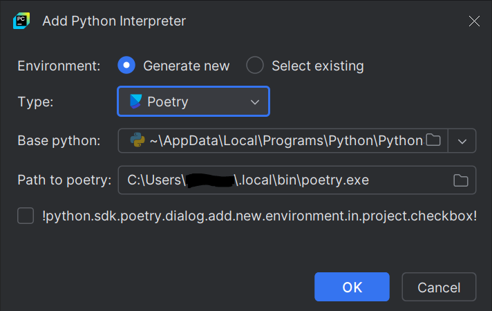

# PyEIT Framework with GUI

This project provides a framework with a graphical user interface for working with the PyEIT package. It's meant to be
used with the modifications of the PyEIT package at the Technical University of Chemnitz (TUC).

## Description

The framework provides a registry file, where new meshes can be registered (lung mesh, forearm mesh, ...). The user has
to implement a function, which processes the voltage data and returns the plotting data. Then this function has be
registered with the mesh type in the registry. In the graphical user interface the new implemented mesh type is then
listed and can be selected.

> [!NOTE]
> The application needs to restart, to recognize a new mesh type.

## Getting Started

**clone the repo**
```commandline
git clone https://github.com/illy777/project_lab
```

### Install dependencies with poetry

1. Install [poetry](https://python-poetry.org/). (you can find the instructions [here](https://python-poetry.org/docs/#installing-with-pipx))

2. If Pycharm is used, a new virtual environment needs to be created and added as the interpreter. As shown in the image
below poetry needs to be selected as the type. Furthermore, the right python version has to be selected. The path to
the poetry executable should be selected automatically.



> [!TIP]
> The python version of the project can be found in the [pyproject.toml](pyproject.toml) file.

3. After creation of the poetry environment pycharm should install all dependencies automatically from the
[pyproject.toml](pyproject.toml) file.

4. To install the dependencies from the console the following command can be used:

````commandline
poetry install
````

### Install dependencies manually

The dependencies from the [pyproject.toml](pyproject.toml) file can also be installed manually with pip. If dependency
conflicts or other problems occur installation with poetry can be used as described [above](#install-dependencies-with-poetry).

### Running the project

To start the program the *main.py* script needs to be run in the root directory of the project. If poetry is used the
following command can be used to run the script:

````commandline
poetry run python .\main.py
````

Otherwise, a run-configuration has to be setup in pycharm or any other IDE to run the main.py file. If you've set up
the poetry environment, pycharm should use it automatically to run python.

## Dependencies

- All dependencies are listed in [pyproject.toml](pyproject.toml)
- The project focuses on running on windows, but linux or mac should also work.

## Adding a new mesh type

In order to add a new mesh type to the framework follow the instructions [here](pipelines/README.md).

## Development

The project is divided into three parts: backend, frontend and pipelines. The following tables gives an overview how
these are structured.

| Part | Folder | Description |
-------------------------------
|Backend|app|Contains the backend thread, which fetches the voltage data, hands it over to the chosen pipeline and sends the result to the gui for visualisation.|
-------------------------------
|Frontend|gui|Contains the gui classes for the frontend thread to display all widgets.|
-------------------------------
|Pipelines|pipelines|Contains all classes and files for the mesh types needed to use the framework.|
-------------------------------

Detailed instructions on how to use poetry can be found [here](https://python-poetry.org/docs/basic-usage/).

Quick overview (terminal):

- Adding new dependencies:
````commandline
poetry add <package-name>(optional verion restrictions)
````

- The dependency setup of the project is saved in the ```poetry.lock``` file. This can be done as following:
````commandline
poetry lock
````

> [!TIP]
> The poetry.lock file can be committed into git. Because these locked dependencies are used for installation and
> make the setup reproducible.

## Authors

- Isaac Lucas de Lima Yuki <[isaacyuki@hotmail.com](mailto:isaacyuki@hotmail.com)>
- Ömer Faruk KANMAZ <[kanmazomerfaruk@outlook.com](mailto:kanmazomerfaruk@outlook.com)>
- Ivana Kotaras <[kotaras.ivana@gmail.com](mailto:kotaras.ivana@gmail.com)>
- Thomas Harald Reinhard Rubin <[thomas.rubin2@protonmail.com](mailto:thomas.rubin2@protonmail.com)>

## License

This project is licensed under the MIT License - see the LICENSE.md file for details
